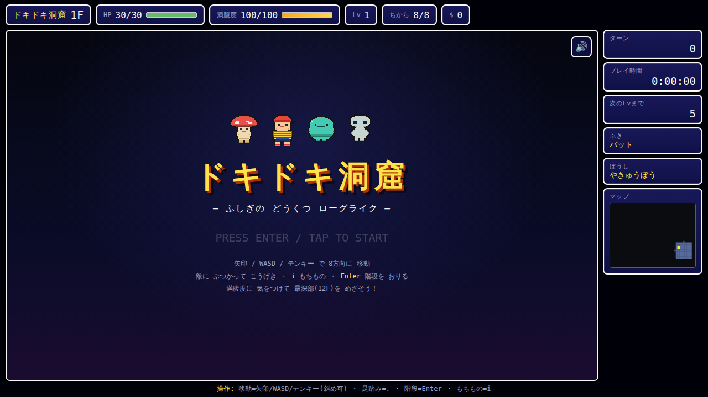
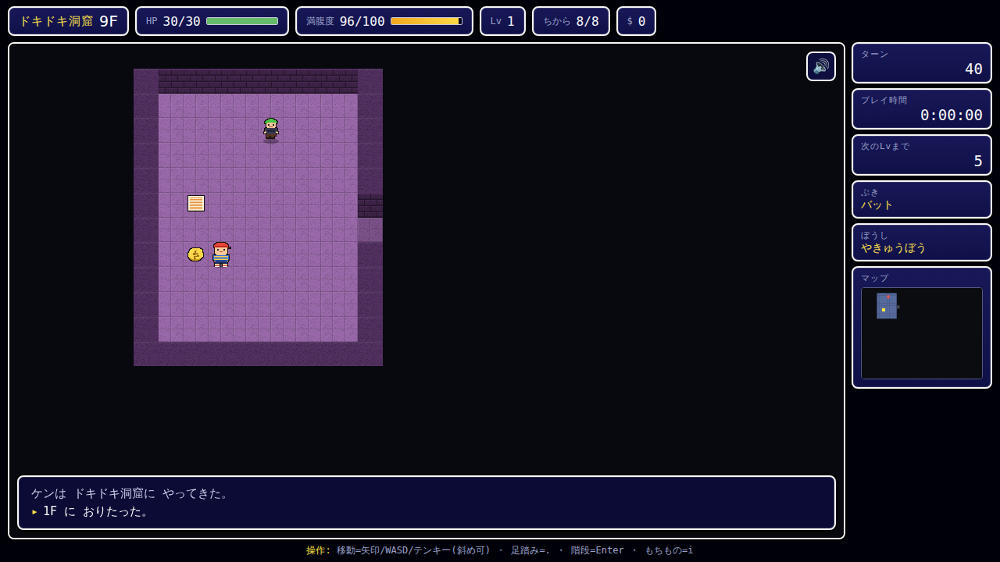

# Rogue-like 〜ドキドキ洞窟〜

風来のシレン風システム × MOTHER2風の世界観・ドット絵の **ローグライクRPG**（Web / HTML5 Canvas 製）。
ブラウザだけで遊べる、自動生成ダンジョン探索ゲームです。




## 特徴（実装済みのコア機能）

- 🎬 **タイトル画面** … アニメするドット絵キャラ付き。Enter / タップでスタート
- 🎨 **MOTHER2風 高精細ドット絵** … キャラ・アイテムは32×32ピクセルで作画。**自動アウトライン生成**＋陰影でEarthBound風の見た目（外部画像不要・全部コード定義）
- 🧱 **高精細タイル** … 床/通路/壁(レンガの崖面・岩の上面)を32×32でプロシージャル生成。フロア深度でパレットが変化（洞窟→青の鉱窟→サイケな紫）
- 🚶 **歩行アニメ** … 2フレームの足の動き＋上下バウンド、向き反転
- 💥 **戦闘エフェクト** … 斬撃のきらめき・ダメージ数字のポップアップ・会心表示・踏み込み・被弾フラッシュ・撃破時の粒子・画面ゆれ
- 🔊 **チップチューンBGM＆効果音** … Web Audioだけで生成（外部音源なし）。攻撃/回復/レベルアップ/階段など効果音つき。`M`キーでミュート
- 🌎 **MOTHER2風の世界観** … 赤帽子の少年ケン、うろつきキノコ・うちゅうじんグレイ・ガラクタロボなどヘンな敵たち、バットとやきゅうぼうで武装
- 🗺 **自動生成ダンジョン** … グリッド分割方式で部屋＋通路を毎回ランダム生成。深度で変わるタイルパレット（洞窟→青の鉱窟→サイケな紫）
- 🎮 **ターン制** … プレイヤーが1手動くと敵も1手動く（斜め移動対応）
- ⚔ **戦闘** … ちから＋ぶき vs ぼうぎょ＋ぼうし。会心の一撃あり
- 👹 **敵AI** … 追跡 / 不規則移動 / 徘徊、みならいコックの特殊行動
- 🎒 **アイテム** … ぶき・ぼうし・くすり・チラシ・ハンバーガー・ステッキ（装備／使用／置く、未識別→識別）
- 🍔 **満腹度システム** … ターン経過で減少、0でHPが減る。ハンバーガーで回復
- 📈 **レベルアップ** … 経験値でHP・ちから上昇
- 🪜 **階段でフロア進行** … 最深部（12F）到達でクリア
- 💀 **倒れたらゲームオーバー**
- 🗺 **ミニマップ** ＆ 部屋単位の視界（FOV）
- 📱 **スマホ対応**（方向パッド・タッチ操作）、MOTHER2風ウィンドウUI＋ドットフォント(DotGothic16)

## 遊び方（起動）

ES Modules を使っているため、ローカルサーバー経由で開いてください。

```bash
# このディレクトリで
python3 -m http.server 8000
# または
npm start
```

ブラウザで <http://localhost:8000/> を開く。

## 操作

| 操作 | キー |
|------|------|
| 移動（8方向） | 矢印キー / WASD / テンキー / vi風(hjkl yubn) |
| 足踏み（休む） | `.` または `5` |
| 階段を降りる | `Enter`（階段の上で） |
| もちもの | `i` または `Tab` |
| もちもの内：選択 | `↑`/`↓` |
| もちもの内：使う/装備 | `Enter` |
| もちもの内：置く | `t` |
| 音のオン/オフ | `M` または 🔊ボタン |
| スタート / リスタート | `Enter`（タイトル・死亡後） |

スマホでは画面下の方向パッド・「階段」「もちもの」ボタンで操作。

## 構成

```
index.html        画面レイアウト
css/style.css     UIスタイル
js/
  main.js         エントリポイント・入力処理・ゲームループ
  game.js         ゲーム状態・ターン処理・戦闘・敵AI（DOM非依存）
  dungeon.js      ダンジョン自動生成
  entity.js       プレイヤー／モンスター
  items.js        アイテム生成・効果
  data.js         モンスター・アイテムのマスターデータ
  sprites.js      ドット絵スプライト定義（16x16ピクセルマップ・歩行フレーム）・タイルテクスチャ
  renderer.js     Canvas描画（スプライト・歩行アニメ・戦闘エフェクト・画面ゆれ・ミニマップ）
  audio.js        Web AudioによるチップチューンBGM＆効果音（外部音源なし）
  ui.js           HUD・ログ・もちものメニュー
  rng.js          乱数ユーティリティ
test/sim.js       ヘッドレス簡易シミュレーション（ロジック検証）
```

## テスト

ブラウザ無しでロジックの実行時エラー・不変条件を検証：

```bash
npm test   # = node test/sim.js
```

## 今後の拡張アイデア

- 罠・モンスターハウス・お店
- 装備の合成・印システム
- アイテムを「投げる」（飛び道具）
- セーブ／スコアランキング
- BGM・効果音・スプライト画像
