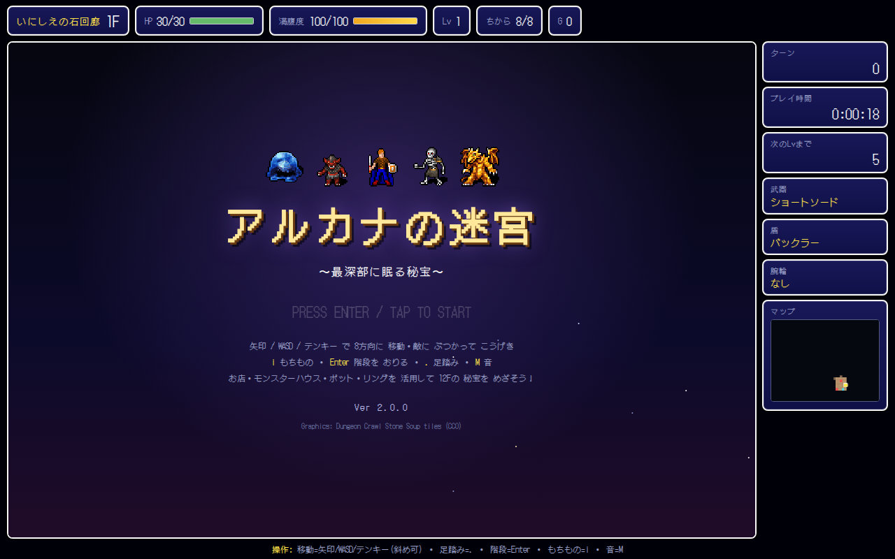
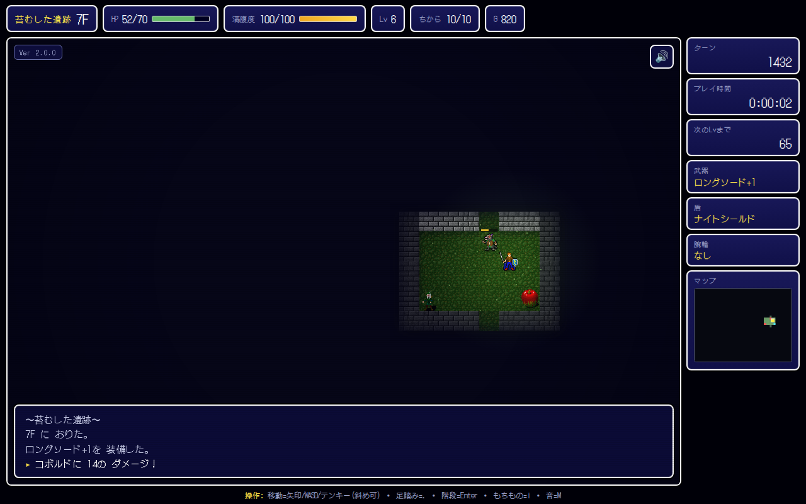
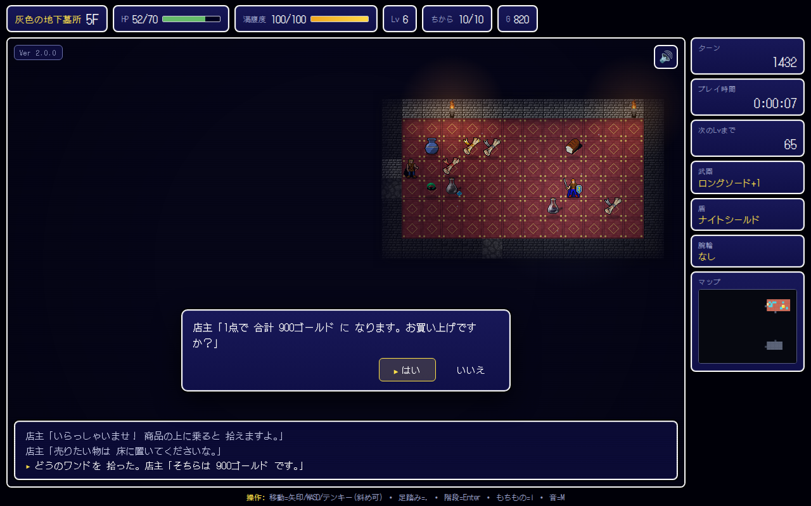
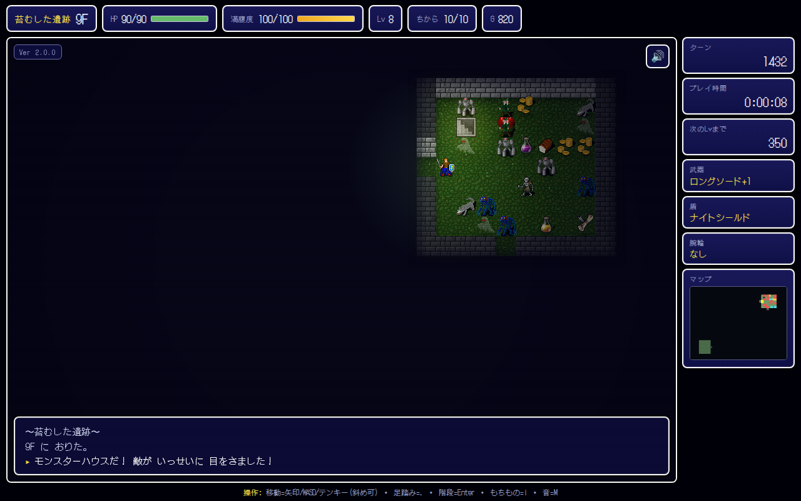

# アルカナの迷宮 〜最深部に眠る秘宝〜（Ver 2.0.0）

風来のシレン風システム × 王道ファンタジーの **ローグライクRPG**（Web / HTML5 Canvas 製）。
ブラウザだけで遊べる、自動生成ダンジョン探索ゲームです。
若き冒険者レオンとなって、12階層の迷宮の最深部に眠る秘宝『アルカナの宝珠』をめざします。




## v2.0.0 の主な変更（v0.1 からの大型アップデート）

- 🏰 **世界観を王道ファンタジーに一新** … タイトル「アルカナの迷宮」、主人公レオン、アイテム名は洋風カタカナ
- 🎨 **グラフィックを画像素材に刷新** … Dungeon Crawl Stone Soup の CC0 タイルを使用。**装備した武器・盾が主人公の見た目に反映**される
- 🗺 **3フロアごとに景色が変わる4エリア** … いにしえの石回廊 → 灰色の地下墓所 → 苔むした遺跡 → アルカナの深層
- 🛒 **お店**（出現率 約20%）… 買う・売る・**泥棒**。代金を払わずに外へ出ると店主が怒って倍速で追いかけてくる
- 👹 **モンスターハウス**（3F以降・約15%）… 眠っている敵とアイテムがたくさん。部屋に入ると一斉に目覚める
- 🏺 **ポット（壺）** … アナライズポット（入れた物の正体がわかる）・チェンジポット（入れた物が別の物に変わる）。**「割る」** と中身が出てくる
- 💍 **リング（腕輪）** … ヒールリング・サーチリング・スタミナリング（装備枠1つ）
- 🔍 **種類ごとの識別** … 未識別品は「あかいポーション」「きのワンド」などの見た目がゲームごとにシャッフル。1つわかれば同じ種類は全部わかる
- 👾 **敵15種・アイテム35種** … 盗んでワープするゴブリンシーフ、壁をすり抜けるゴースト、矢を射るダークアーチャー、炎を吐くゴールドドラゴン、倍速のウルフ、鈍足で重いアイアンゴーレム、再生するトロールなど
- 🎵 **BGMを作り直し** … タイトル・エリアごと（4曲）・お店・危険（モンスターハウス／店主激怒）の7曲を場面に合わせて切り替え
- 🧭 **ダンジョン生成を強化** … 部屋の並び（3×2〜4×3）や通路の分岐点がフロアごとに変わる。必ず全部の部屋がつながる
- 🪟 **持ち物メニューを刷新** … アイテムを選ぶと「使う／装備／入れる／割る／置く／説明」などのメニュー。説明欄つき
- 🏷 **バージョン番号を画面に表示**（タイトル画面とゲーム画面の左上）

<p>


</p>

## 特徴

- 🎮 **ターン制** … プレイヤーが1手動くと敵も1手動く（斜め移動対応）。倍速・鈍足の敵もいる
- ⚔ **戦闘** … ちから＋武器 vs 盾。会心の一撃あり。壁の角ごしには攻撃できない
- 🍞 **満腹度** … ターン経過で減少し、0になるとHPが減る
- 📈 **レベルアップ** … 経験値でHP・ちから上昇（ポーションで増えた分は消えない）
- 🪜 **12Fの階段を降りるとクリア**、倒れたらゲームオーバー（タイトルに戻る）
- 🔥 **演出** … 動的ライティング、壁の松明、なめらか移動、パーティクル、飛び道具や雷のエフェクト、フロア移動のアイリスワイプ
- 🗺 **ミニマップ**（お店は赤、ゴールドは黄色、サーチリング装備中は全部の敵が見える）
- 🔊 **チップチューンBGM＆効果音** … Web Audioだけで生成（外部音源なし）
- 📱 **スマホ対応**（方向パッド・タッチ操作）

## 遊び方（起動）

ES Modules を使っているため、ローカルサーバー経由で開いてください。

```bash
# このディレクトリで
python3 -m http.server 8000
# または
npm start
```

ブラウザで <http://localhost:8000/> を開く。

## 操作

| 操作 | キー |
|------|------|
| 移動（8方向）・攻撃 | 矢印キー / WASD / テンキー / vi風(hjkl yubn) |
| 足踏み（休む） | `.` または `5` |
| 階段を降りる | `Enter`（階段の上で） |
| もちもの | `i` または `Tab` |
| もちもの内：選択 / メニュー / 閉じる | `↑`/`↓` / `Enter` / `Esc` |
| もちもの内：置く（ショートカット） | `t` |
| 確認・選択ダイアログ | `↑`/`↓`（`←`/`→`）で選び `Enter`、`Esc` でやめる |
| 音のオン/オフ | `M` または 🔊ボタン |
| スタート / タイトルへ | `Enter`（タイトル・ゲームオーバー後） |

スマホでは画面下の方向パッド・「階段」「もちもの」ボタンで操作し、メニューはタップで選びます。

## お店の使い方

- 商品の上に乗ると拾えます（未払い）。出口へ向かうと店主が代金を聞いてくるので「はい」で支払い
- 店主にぶつかると話しかけて支払いできます
- 自分の持ち物をお店の床に置くと、店主が買い取りを申し出ます
- 未払いのままテレポートスクロールやスワップワンドでお店の外に出ると……泥棒です

## 構成

```
index.html          画面レイアウト
css/style.css       UIスタイル
assets/tiles.png    タイルアトラス（Dungeon Crawl Stone Soup の CC0 タイル）
assets/CREDITS.md   画像素材のクレジット
js/
  main.js           エントリポイント・入力処理・ゲームループ・BGM切り替え
  version.js        バージョン番号とタイトル
  game.js           ゲーム状態・ターン処理・戦闘・敵AI・お店・モンスターハウス・アイテム効果（DOM非依存）
  dungeon.js        ダンジョン自動生成
  entity.js         プレイヤー／モンスター
  items.js          アイテム生成・識別（見た目のシャッフル）・表示名・価格
  data.js           モンスター・アイテム・エリアのマスターデータ
  atlas.js          タイルアトラスの対応表（自動生成）
  sprites.js        アトラスの読み込み・主人公の装備の重ね描き・タイル
  renderer.js       Canvas描画（移動補間・ライティング・パーティクル・エフェクト・ミニマップ）
  audio.js          Web AudioによるチップチューンBGM（7曲）＆効果音
  ui.js             HUD・ログ・もちものメニュー・確認ダイアログ
  rng.js            乱数ユーティリティ
tools/build_assets.py  タイルアトラスの生成スクリプト
test/sim.js         ヘッドレスシミュレーション（ロジック検証）
```

## テスト

ブラウザ無しでロジックの実行時エラー・不変条件を検証します。
自動プレイ60回に加え、お店（支払い・呼び止め・泥棒・売却）、モンスターハウス、ポット、リング、識別、ゴブリンシーフ、素材の対応表をシナリオで確認します。

```bash
npm test   # = node test/sim.js
```

## 画像素材の作り直し

タイルを差し替えるときは `tools/build_assets.py` を編集して再生成します（Python と Pillow が必要）。

```bash
git clone --depth 1 https://github.com/crawl/tiles crawl-tiles
pip install pillow
python3 tools/build_assets.py crawl-tiles/releases
```

## クレジット

- 画像：[Dungeon Crawl Stone Soup](https://github.com/crawl/crawl) のタイル（[crawl/tiles](https://github.com/crawl/tiles)、CC0）。詳しくは [assets/CREDITS.md](assets/CREDITS.md)
- フォント：[DotGothic16](https://fonts.google.com/specimen/DotGothic16)（Google Fonts）
